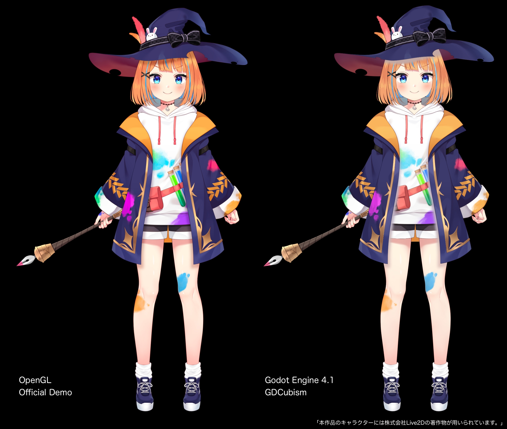

= Cubism for GDScript
:author: MizunagiKB
:doctype: book
:toc:
:toclevels: 3
:lang: ja
:encoding: utf-8
:stylesdir: ./res/theme/css
:stylesheet: adoc-golo.css
:source-highlighter: highlight.js
:experimental:
ifndef::env-github[:icons: font]
ifdef::env-github,env-browser[]
endif::[]
ifdef::env-github[]
:caution-caption: :fire:
:important-caption: :exclamation:
:note-caption: :paperclip:
:tip-caption: :bulb:
:warning-caption: :warning:
endif::[]

link:PROBLEM.adoc[Japanese] / English

== 未解決の不具合について

GDCubism は GodotEngine 上でLive2Dモデルを簡単に扱う GDExtension として開発しています。

また描画においても、現在のバージョンはLive2Dモデルの製作者には到底満足いかない出力結果です。

ここでは判明している不具合について列挙します。

=== 加算と乗算合成の不具合

GDCubismでは、Live2Dのモデルを直接フレームバッファに描かずに、SubViewport（RenterTaget）に描いています。
 +
その関係上、現在アルファ値を持った加算と乗算合成が行えません。この問題は特にマスク機能を使用した時に顕著に現れます。

このLive2Dモデルでは帽子の下や上着の下に影を置いているのですが、ここがマスク付き乗算処理となっています。

現在の自分の実装ではアルファ付きの描画をアルファ付きのSubViewportに対して行うと、本来透明になって欲しくない場所まで透明になってしまいます。

そのため、絵が完全におかしくなるよりそれっぽい表示になる様に全ての描画処理を通常合成（mix）で行う様になっています。

半透明合成を行うときは加算や乗算処理を行わない様なLive2Dモデルにすると、比較的遜色のない結果が得られます。

