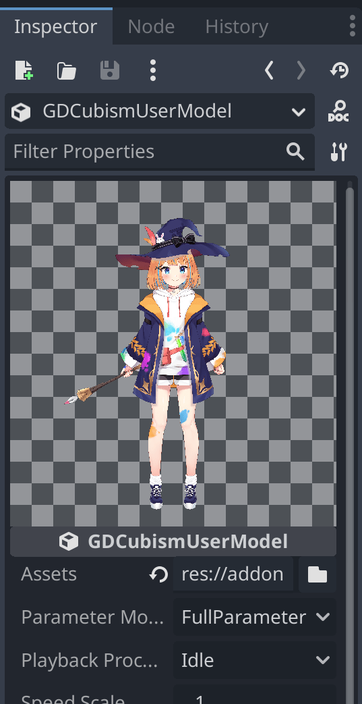
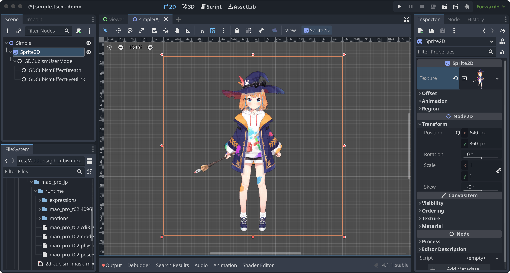

= Usage
:author: MizunagiKB
:copyright: 2023 MizunagiKB <mizukb@live.jp>
:doctype: book
:toc:
:toclevels: 3
:lang: ja
:encoding: utf-8
:stylesdir: ./res/theme/css
:stylesheet: adoc-golo.css
:source-highlighter: highlight.js
:experimental:
ifndef::env-github[:icons: font]
ifdef::env-github,env-browser[]
endif::[]
ifdef::env-github[]
:caution-caption: :fire:
:important-caption: :exclamation:
:note-caption: :paperclip:
:tip-caption: :bulb:
:warning-caption: :warning:
endif::[]

link:USAGE.adoc[Japanese] / link:USAGE.en.adoc[English]

== How to use

After the GDExtension build completes successfully, copy it to the addons of the project you want to use gd_cubism folder in the demo/addons folder.

=== Easy to use (from Editor)

Describes how to import a Live2D model and view it in _Sprite2D_.

==== Layout

Please arrange the nodes in the same way while referring to the figure below.

image::res/images/usage_simple_01.png[fig01,256]

==== Loading Live2D Models

Select _GDCubismUserModel_ from the node list and press the file selection button to the right of the Assets item.
 +
 +
A file selection dialog will appear, from which you can select any *.model3.json file.

image::res/images/usage_simple_02.png[fig02,256]

==== Are you seeing a Live2D model?

Once the Live2D model is loaded correctly, the preview screen displays the Live2D model.

==== Assign to Sprite2D texture

Then select the _Sprite2D_ node to open the Texture item. +
When you select ''New ViewportTexture'' from the list, a dialog to select _Viewport_ will appear, select _GDCubismUserModel_.

image::res/images/usage_simple_04.png[fig04,256]

The Live2D model is displayed in the Texture field.

image::res/images/usage_simple_05.png[fig05,256]

The Live2D model is also displayed at the _Sprite2D_ position.

=== Troubleshooting

* Model does not load properly

If the model file name is in Japanese, it will not load properly, so overwriting the file name output by the Cubism Editor and the reference in *.model3.json will work properly.

* Blink does not occur normally

It is possible that the Ids for EyeBlink in *.model3.json is not specified. Please set it and re-export, or add ParamEyeLOpen and ParamEyeROpen to Ids.

== API Reference / C# Support status

GDCubism provides a variety of classes. Please refer to the document linked below for how to use it.

[cols="^1,^1,^1",frame=none,grid=none]
|===
|GDScript Class |C# Class |Features

|GDCubismEffect |GDCubismEffectCS |-
|link:API/ja/API_gd_cubism_effect_breath.ja.adoc[GDCubismEffectBreath]
|GDCubismEffectBreathCS
|△

|GDCubismEffectCustom
|GDCubismEffectCustomCS
|△

|link:API/ja/API_gd_cubism_effect_eye_blink.ja.adoc[GDCubismEffectEyeBlink]
|GDCubismEffectEyeBlinkCS
|△

|GDCubismEffectHitArea |GDCubismEffectHitAreaCS |△
|GDCubismEffectTargetPoint |GDCubismEffectTargetPointCS |△

|link:API/ja/API_gd_cubism_motion_entry.ja.adoc[GDCubismMotionEntry]
|GDCubismMotionEntryCS
|x

|link:API/ja/API_gd_cubism_motion_queue_entry_handle.ja.adoc[GDCubismMotionQueueEntryHandle]
|GDCubismMotionQueueEntryHadleCS
|x

|GDCubismValueAbs |GDCubismValueAbsCS |-

|link:API/ja/API_gd_cubism_parameter.ja.adoc[GDCubismParameter]
|GDCubismParameterCS
|○

|link:API/ja/API_gd_cubism_part_opacity.ja.adoc[GDCubismPartOpacity]
|GDCubismPartOpacityCS
|○

|link:API/ja/API_gd_cubism_user_model.ja.adoc[GDCubismUserModel]
|GDCubismUserModelCS
|○
|===
