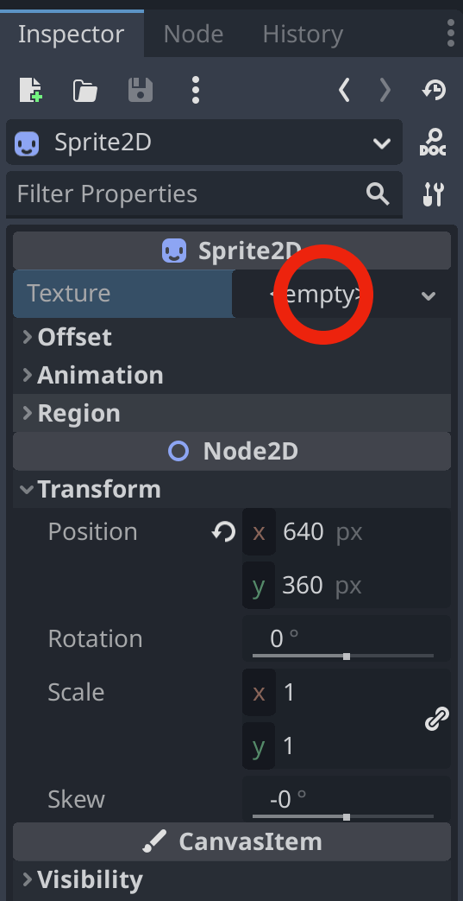
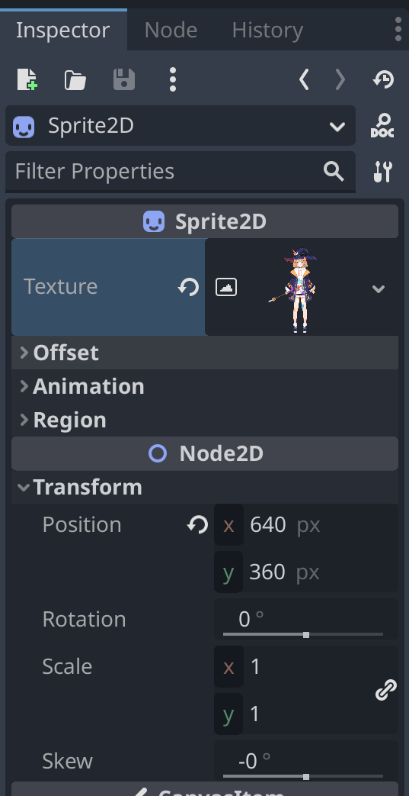

= Usage
:encoding: utf-8
:lang: en
:author: MizunagiKB <mizukb@live.jp>
:copyright: 2023 MizunagiKB
:doctype: book
:nofooter:
:toc: left
:toclevels: 3
:source-highlighter: highlight.js
:icons: font
:experimental:
:stylesdir: ./res/theme/css
:stylesheet: mizunagi-works.css
ifdef::env-github,env-vscode[]
:adocsuffix: .adoc
endif::env-github,env-vscode[]
ifndef::env-github,env-vscode[]
:adocsuffix: .html
endif::env-github,env-vscode[]

link:USAGE{adocsuffix}[Japanese] / link:USAGE.en{adocsuffix}[English]

== How to use

If you want to get started right away, please open _project.godot_ located in the _demo_ folder from the Godot Engine editor. (Instructions on how to run the demo are provided below in this document)

If you want to use it in your own project, please copy the contents of the _addons_ folder located in the _demo_ folder to the project you wish to use.

If an _addons_ folder already exists, please copy the contents of the _gd_cubism_ folder.

NOTE: The _addons_ folder is a designated folder for storing programs that extend the Godot Engine, such as GDCubism.

=== Easy to use (from Editor)

Describes how to import a Live2D model and view it in _Sprite2D_.

==== Layout

Please arrange the nodes in the same way while referring to the figure below.

image::res/images/usage_simple_01.png[fig01,256]

==== Loading Live2D Models

Select _GDCubismUserModel_ from the node list and press the file selection button to the right of the Assets item.
 +
 +
A file selection dialog will appear, from which you can select any *.model3.json file.

image::res/images/usage_simple_02.png[fig02,256]

==== Are you seeing a Live2D model?

Once the Live2D model is loaded correctly, the preview screen displays the Live2D model.

image::res/images/usage_simple_03.png[fig03,256]

==== Assign to Sprite2D texture

Then select the _Sprite2D_ node to open the Texture item. +
When you select ''New ViewportTexture'' from the list, a dialog to select _Viewport_ will appear, select _GDCubismUserModel_.

The Live2D model is displayed in the Texture field.

The Live2D model is also displayed at the _Sprite2D_ position.

image::res/images/usage_simple_06.png[fig06,512]

=== Troubleshooting

* Model does not load properly

If the model file name is in Japanese, it will not load properly, so overwriting the file name output by the Cubism Editor and the reference in *.model3.json will work properly.

* Blink does not occur normally

It is possible that the Ids for EyeBlink in *.model3.json is not specified. Please set it and re-export, or add ParamEyeLOpen and ParamEyeROpen to Ids.

== About the Demo

The _demo_ folder contains the following items as samples. To run any of the samples, you will need the Live2D model of Nijiiro Mao.

This Live2D model can be downloaded from link:https://www.live2d.com[].

Please arrange the contents of the downloaded file as follows:

* (_demo/addons/gd_cubism/example/res/live2d_)
** mao_pro_jp
*** runtime
**** expressions
***** ...
**** map_pro_t02.4096
***** ...
**** motions
***** ...
**** mao_pro_t02.cdi3.json
**** mao_pro_t02.moc3
**** mao_pro_t02.model3.json
**** mao_pro_t02.physics3.json
**** mao_pro_t02.pose3.json
*** mao_pro_t02.can3
*** mao_pro_t02.cmo3

If you want to try with your own model, please place the output referring to the above in _demo/addons/gd_cubism/example/res/live2d_.

=== Description of the Demo

[cols="1,1",frame=none,grid=none]
|===
^|Name ^|Desc

|demo_effect_custom_01.tscn
|This is a sample using _GDCubismEffectCustom_.

|demo_effect_custom_02.tscn
|This is a sample using _GDCubismEffectCustom_. It performs a simple lip sync, moving the mouth according to the volume.

|demo_effect_custom_03.tscn
|This is a sample using _GDCubismEffectTargetPoint_. The Live2D model will look in the direction of the mouse position.

|demo_effect_hit_area.tscn
|This is a sample using _GDCubismEffectHitArea_. It also serves as a usage sample for the _HitArea_ set in the Live2D model.

|demo_simple.tscn
|This is a sample that displays the Live2D model only with a combination of Nodes.

|demo_transparent.tscn
|This is a sample that displays only the character by making the surroundings of the Live2D model transparent.

|viewer.tscn
|This is a sample that also serves as a simple viewer. You can play _Expression_ and _Motion_.

|===

NOTE: The program is available in both GDScript and C# versions. You can check the operation by replacing the script assigned to the tscn file.

== API Reference / C# Support status

GDCubism provides a variety of classes. Please refer to the document linked below for how to use it.

[cols="^1,^1,^1",frame=none,grid=none]
|===
|GDScript Class |C# Class |Features

|link:API/en/API_gd_cubism_effect.en{adocsuffix}[GDCubismEffect]
|GDCubismEffectCS
|-

|link:API/en/API_gd_cubism_effect_breath.en{adocsuffix}[GDCubismEffectBreath]
|GDCubismEffectBreathCS
|△

|link:API/en/API_gd_cubism_effect_custom.en{adocsuffix}[GDCubismEffectCustom]
|GDCubismEffectCustomCS
|△

|link:API/en/API_gd_cubism_effect_eye_blink.en{adocsuffix}[GDCubismEffectEyeBlink]
|GDCubismEffectEyeBlinkCS
|△

|link:API/en/API_gd_cubism_effect_hit_area.en{adocsuffix}[GDCubismEffectHitArea]
|GDCubismEffectHitAreaCS
|△

|link:API/en/API_gd_cubism_effect_target_point.en{adocsuffix}[GDCubismEffectTargetPoint]
|GDCubismEffectTargetPointCS
|△

|link:API/en/API_gd_cubism_motion_entry.en{adocsuffix}[GDCubismMotionEntry]
|GDCubismMotionEntryCS
|x

|link:API/en/API_gd_cubism_motion_queue_entry_handle.en{adocsuffix}[GDCubismMotionQueueEntryHandle]
|GDCubismMotionQueueEntryHadleCS
|x

|link:API/en/API_gd_cubism_value_abs.en{adocsuffix}[GDCubismValueAbs]
|GDCubismValueAbsCS
|-

|link:API/en/API_gd_cubism_parameter.en{adocsuffix}[GDCubismParameter]
|GDCubismParameterCS
|○

|link:API/en/API_gd_cubism_part_opacity.en{adocsuffix}[GDCubismPartOpacity]
|GDCubismPartOpacityCS
|○

|link:API/en/API_gd_cubism_user_model.en{adocsuffix}[GDCubismUserModel]
|GDCubismUserModelCS
|○
|===

